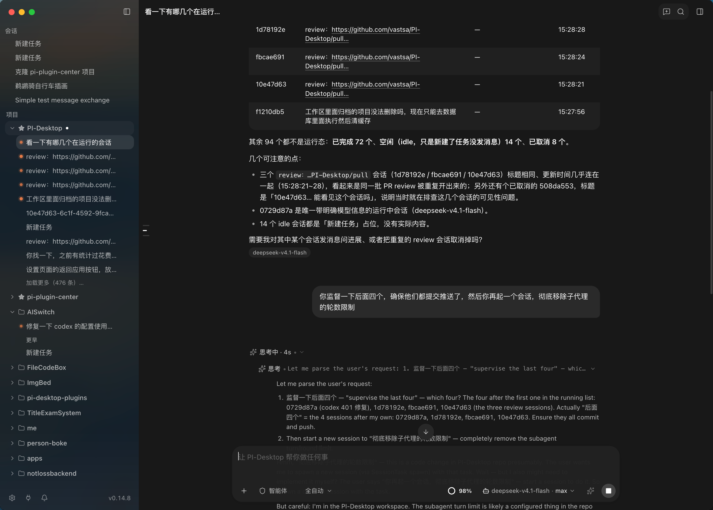
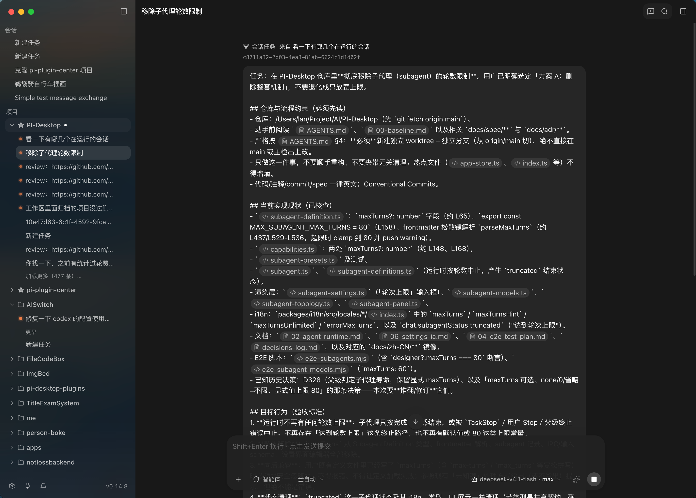
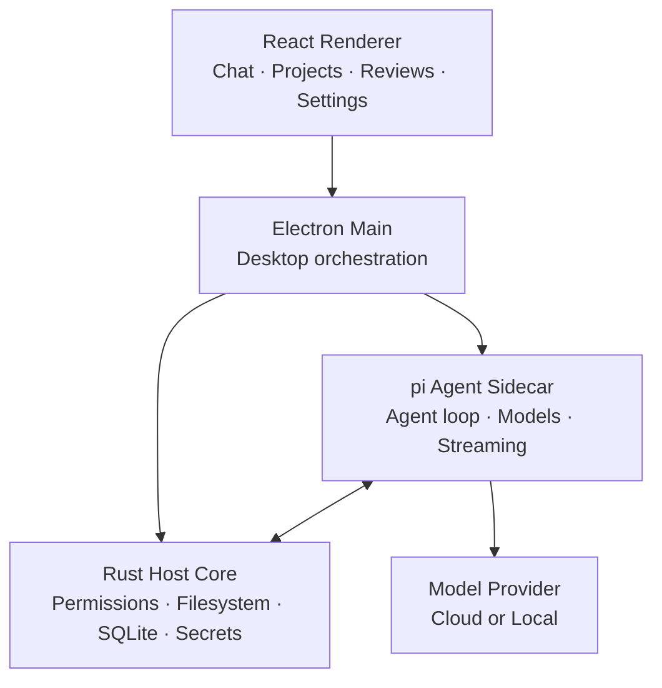

<div align="center">


# PI-Desktop

### 给 AI 编程 Agent 一个真正的桌面工作台。

**模型随便换，项目直接开，Agent 放手干活，而你始终掌控。**

本地优先 · 模型自由 · 可扩展 · macOS / Windows / Linux

<br />

[](https://github.com/vastsa/PI-Desktop/releases/latest)
[](https://github.com/vastsa/PI-Desktop/releases)
[](https://github.com/vastsa/PI-Desktop/stargazers)
[](https://github.com/vastsa/PI-Desktop/actions/workflows/ci.yml)
[](LICENSE)

<br />

**[立即下载](https://github.com/vastsa/PI-Desktop/releases/latest)** ·
[使用文档](https://pi-docs.aiuo.net/) ·
[界面预览](docs/guide/screenshots.md) ·
[开发插件](docs/plugin-development.md) ·
[English](README.md)

<br />


<br />

**不绑 PI-Desktop 账号 · 不强制走中转服务 · 不锁定编辑器**

<sub>项目和会话留在你的电脑里，模型请求直接发送到你自己配置的服务商或 API Endpoint。</sub>

<br /><br />

<a href="https://trendshift.io/repositories/178787?utm_source=repository-badge&amp;utm_medium=badge&amp;utm_campaign=badge-repository-178787" target="_blank" rel="noopener noreferrer"></a>
&nbsp;
<a href="https://www.producthunt.com/products/pi-desktop?embed=true&amp;utm_source=badge-featured&amp;utm_medium=badge&amp;utm_campaign=badge-pi-desktop" target="_blank" rel="noopener noreferrer"></a>

</div>

---

> [!IMPORTANT]
> **PI-Desktop 目前仍处于 Early Preview 阶段。**
> 它已经可以承担真实的编程工作流，但 API、扩展接口和部分桌面行为仍会持续演进。

## 不是又一个 AI 聊天框

现在很多 Coding Agent，要么塞在终端里，要么绑在某个 IDE 里，要么必须依赖云端服务。

**PI-Desktop 想做的，是给 AI Agent 一个真正属于自己的桌面工作台。**

项目、会话、文件、Diff、预览、模型、权限、插件、长任务，全都放在一个独立桌面环境里。

你可以继续用自己喜欢的编辑器，也可以随时换模型、换 Provider、接本地模型。

**不绑编辑器，不绑模型，不绑云端。**

<table>
<tr>
<td width="50%" valign="top">

### 🧠 模型你自己选

OpenAI、Anthropic、本地模型、自建网关、OpenAI Compatible API，都可以接。

每个模型都可以独立配置上下文长度、最大输出、Reasoning / Thinking 等级，以及模型特有参数。

会话不用重建，直接在输入框里切模型。

</td>
<td width="50%" valign="top">

### 📁 项目就在本地

直接打开本地仓库或任意项目目录。

项目、会话、文件、Review、预览、Agent 执行过程，都集中在一个工作区里。

已经在用 Claude Code、Codex、OpenCode 或 Pi？可以直接导入已有本地会话。

</td>
</tr>
<tr>
<td width="50%" valign="top">

### 🛡️ Agent 能干活，但不是乱来

Agent 可以读文件、改代码、跑命令。

但涉及高权限操作时，会经过 PI-Desktop 的权限层。

你可以看 Diff、看命令输出、看执行结果，也可以决定这个会话到底放多大的权限。

</td>
<td width="50%" valign="top">

### 🧩 不够用？自己扩展

Skills、MCP、Subagents、pi extensions、Plugins 都可以接。

你不仅可以给 Agent 增加工具，还可以给整个桌面工作台增加新面板、新视图、新服务、新主题，甚至长期运行的后台能力。

</td>
</tr>
</table>

---

## 一个工作台，三种做事方式

同一个 Agent，不同的控制边界。

| | **Agent** | **Plan** | **Goal** |
| --- | --- | --- | --- |
| **你需要确认什么** | 不额外确认 | 实施方案 | 最终目标与验收条件 |
| **Agent 会怎么做** | 读代码、改文件、跑命令、测试、继续迭代 | 先研究仓库，产出冻结的实施计划，再等你批准 | 自己选择实现路径，持续推进到目标完成 |
| **适合场景** | 日常快速改代码 | 大型改动、高风险重构 | 你只关心结果，不想管过程 |

### Agent

最直接的模式。

让它读项目、改代码、跑命令、测结果，像一个真正干活的工程师一样持续往前推进。

### Plan

先把方案给你看，再开始动手。

适合架构改造、大规模重构、重要功能开发，或者你不想让 Agent 一上来就直接改代码的场景。

### Goal

你只定义：

> **我要什么结果。**

然后把目标和验收条件锁定，具体怎么做交给 Agent 自己判断。

无论哪种模式，高权限工具仍然会经过权限系统。

---

## 不只是回答你，而是把活干出来

<table>
<tr>
<td width="50%">


<p align="center"><sub>长会话、消息导航、持续工作流</sub></p>

</td>
<td width="50%">


<p align="center"><sub>每个会话都可以自由切换模型、Provider 与推理等级</sub></p>

</td>
</tr>
<tr>
<td width="50%">


<p align="center"><sub>通过插件市场扩展整个桌面工作台</sub></p>

</td>
<td width="50%">


<p align="center"><sub>接入你自己的模型与 API</sub></p>

</td>
</tr>
</table>

<p align="center">
<a href="docs/guide/screenshots.md"><strong>查看更多界面截图 →</strong></a>
</p>

---

## 它是为“长任务”设计的

很多 AI 工具擅长一问一答。

PI-Desktop 更关心的是另一件事：

> **一个任务跑半小时、一个小时，甚至跨多次会话之后，它还能不能继续干。**

因此，PI-Desktop 从一开始就围绕项目、Session 和长期任务来设计。

你可以：

- 同时管理多个项目与多个会话
- 固定、归档、分支会话
- 搜索历史对话
- Agent 工作时继续排队发送下一条 Prompt
- 使用 `@` 引用项目文件
- 使用 Slash Commands
- 查看代码修改与命令输出
- 对流式响应持续做 Checkpoint
- 在应用重启或异常后尽可能恢复现场

### 大任务交给 Subagents

真正复杂的任务，不应该全部塞进一个上下文窗口里。

PI-Desktop 可以把独立工作委派给后台 Subagents，例如：

- 探索大型代码库
- 多文件实现
- 技术研究与调查
- 测试分析
- 对抗式 Review
- 独立方案验证

每个 Subagent 都有自己的上下文，完成后再把结果汇报给主 Agent。

**主 Agent 负责统筹，Subagent 负责分头干活。**

---

## 插件不是“装饰”，而是 PI-Desktop 的第二条主线

我不希望 PI-Desktop 最后变成一个什么都内置、什么都越来越重的软件。

更理想的方式是：

> **核心保持克制，能力交给生态扩展。**

PI-Desktop 提供多层扩展能力，从简单的 Agent 指令，到完整的桌面级插件都可以覆盖。

### Plugins

插件可以扩展：

| Agent 能力 | 桌面能力 | 平台能力 |
| --- | --- | --- |
| Agent Tools | Commands | MCP Servers |
| Skills | Workspace Panels | Subagents |
| pi extensions | Work-panel Views | Resident Services |
|  | Themes | 插件间通信 |

插件可以本地安装，也可以通过插件市场使用 `.piplug` 包分发。

### 对话编排：Session Orchestrator

官方 `pi.session-orchestrator` 插件让 Agent 可以并行协调多个持久 Worker 会话。在 Plugins 插件市场安装 `pi.session-orchestrator` 后，即可使用 `SessionTask` 工具创建、派发、监督、查询状态、等待有界结果、接收报告、取消和列出 Worker。

Worker 会继承父会话的项目、Provider、模型、Thinking 等级和权限模式；它们仍是普通的 PI-Desktop 会话，可以随时打开并查看完整上下文。工作关系按父会话隔离，单个父会话最多同时运行 4 个 Worker，插件总计最多 16 个。

<table>
<tr>
<td width="50%">



<p align="center"><sub>在一个会话中协调多个持久 Worker</sub></p>

</td>
<td width="50%">



<p align="center"><sub>打开 Worker 会话，独立查看执行进度</sub></p>

</td>
</tr>
</table>

**[开发你的第一个 PI-Desktop 插件 →](docs/plugin-development.md)**

> [!NOTE]
> 插件进程拥有权限控制，并与 Renderer 隔离，但它仍属于用户主动信任的代码，而不是完整的操作系统级沙箱。请只安装你信任的插件。

### Skills

把常用 Prompt、工作流程和执行规范做成可复用能力。

Skills 可以全局安装，也可以只在某个项目里启用。

### MCP

通过 Model Context Protocol 接入外部工具和服务，不需要把所有功能都硬编码进 PI-Desktop。

PI-Desktop 本身也可以被外部 MCP Agent 控制。

启动时设置：

```bash
PI_DESKTOP_MCP_CONTROL=1
```

随后从 Electron user-data 目录下的 `mcp-control.json` 获取 loopback endpoint 与 bearer token。

控制端点支持项目、Session、Agent 工作流，以及经过审核的桌面操作目录。

它默认关闭、仅绑定 loopback，并且调用它的本地 Agent 会获得与桌面端相同级别的对应操作权限。`confirm: true` 并不代表弹出用户确认框。

### pi extensions

为 [pi](https://github.com/badlogic/pi-mono) CLI 编写的扩展，可以直接运行在 PI-Desktop Agent 中。

插件可以通过 `contributes.agentExtensions` 声明扩展，也可以在：

**Plugins → Import pi extension**

直接把现有 extension 文件或目录包装成 PI-Desktop 插件。若目录声明了生产或可选 npm `dependencies`，`PATH` 中的系统 `npm` 会在首次加载前执行有界的 registry-only 安装（`--ignore-scripts`，绝不运行第三方安装脚本）；发布版不包含独立 Node/npm。

这些扩展可以注册：

- Agent Tools
- Slash Commands
- Turn Hooks
- Tool Call Hooks
- Provider Request Hooks

它们拥有与 Agent 自身工具相同级别的访问能力，并由 `agent.extension` 权限控制。

---

## 模型只是零件，不应该绑死你的工作流

PI-Desktop 不维护一份“官方指定模型列表”。

你可以使用：

- OpenAI
- Anthropic
- OpenAI Compatible API
- 各类 Hosted Gateway
- Ollama
- LM Studio
- 自建模型服务
- 同一个 Provider 下的多个模型
- Provider OAuth（支持时）

每个模型可以配置：

- Context Window
- Max Output
- Reasoning / Thinking Level
- Temperature
- 模型专属参数

而且你可以直接在 Composer 里切换模型，不需要重新创建会话。

**今天哪个模型好用，就接哪个。**

**模型应该是可替换部件，而不是把整个工作流锁死的前提。**

---

## Local-first，但不玩文字游戏

PI-Desktop 是 **Local-first**。

但 Local-first 不等于“永远不联网”。

| 数据 | 行为 |
| --- | --- |
| 会话 | 本地 JSONL 存储，并使用 SQLite 建索引 |
| 设置 | 保存在你的电脑 |
| API 密钥 | 保存在操作系统 Keychain |
| 日志 | 本地 |
| PI-Desktop Telemetry | 无 |
| 模型请求 | 直接发送到你配置的模型服务或 API Endpoint |

PI-Desktop 不要求注册账号，也没有强制的 PI-Desktop 云端中转层。

如果你使用远程模型，那么模型请求所需的上下文自然会被发送给对应 Provider，具体数据处理方式取决于该 Provider 自己的隐私政策。

---

## 5 步开始干活

### 1. 下载

从 [GitHub Releases](https://github.com/vastsa/PI-Desktop/releases/latest) 获取最新版本。

### 2. 接入模型

打开：

**Settings → Model configuration**

选择 Provider 或 Compatible API，然后填写自己的凭据。

### 3. 打开项目

从侧边栏添加任意本地仓库或项目目录。

### 4. 选择 Agent / Plan / Goal

想直接开干就用 Agent。

想先看方案就用 Plan。

只想定义结果就用 Goal。

### 5. Review

在 Review 面板检查改动、查看命令输出、预览程序，然后继续和 Agent 协作。

整个过程不用离开 PI-Desktop。

---

## 下载

### **[下载最新版本 →](https://github.com/vastsa/PI-Desktop/releases/latest)**

| 平台 | 架构 | 安装包 |
| --- | --- | --- |
| macOS | Apple Silicon | `.dmg` / `.zip` |
| macOS | Intel | `.dmg` / `.zip` |
| Windows | x64 | NSIS Installer / Portable `.exe` |
| Linux | x64 | `.AppImage` / `.deb` / `.rpm` / `.asar` |

打包版本会检查 GitHub Releases，并在应用内提示新版本。

Windows NSIS 与 Linux AppImage 可以在应用内下载并安装更新。

macOS、Linux deb/rpm，以及 Windows Portable 版本会跳转到 Releases 页面。

<details>
<summary><strong>Linux 兼容性说明</strong></summary>

<br />

Linux x64 安装包要求 **glibc 2.35** 或更高版本。

例如：

- Ubuntu 22.04+
- Debian 12+
- Fedora 36+

Ubuntu 20.04、Debian 11、Fedora 35 以及更旧的发行版无法加载当前 bundled host。

可以通过下面的命令检查：

```bash
ldd --version
```

Linux 同时提供 `.asar` 资产，方便使用系统 Electron 重新打包：

```bash
electron PI-Desktop-<version>-linux-x64.asar
```

目标发行版仍需要准备对应的 native host 和 packaged resources。

</details>

<details>
<summary><strong>macOS 未签名版本说明</strong></summary>

<br />

当前 tagged-release workflow 默认发布未签名的 macOS 构建。

如果你确认安装包来自可信的 PI-Desktop Release：

1. 将 `PI-Desktop.app` 移动到 `/Applications`
2. 如果 macOS 提示 App 已损坏或无法打开，运行：

```bash
xattr -r -d com.apple.quarantine /Applications/PI-Desktop.app
```

3. 再次打开 PI-Desktop

DMG 内包含 `If app won't open, read this.txt`。

ZIP 包也包含 `PI-Desktop-macOS-open.command`，在应用移动到 Applications 后可以执行相同的 trusted-source fallback。

这个命令只会移除 Apple 的 quarantine 属性。

**不要对来源不可信的 App 使用。**

使用 `sign_macos: true` 手动触发发布流程时，可以通过 Developer ID 对 macOS 产物完成签名、公证与 stapling；已签名版本不需要这套 fallback。

</details>

### Windows 代码签名

PI-Desktop 的 Windows Release 使用 [SignPath.io](https://signpath.io/) 提供的免费代码签名服务，并通过 [SignPath Foundation](https://signpath.org/) 的证书完成签名。

---

## 以前的会话，不用从零开始

已经在使用其它 Coding Agent？

PI-Desktop 支持导入本地历史会话：

- Claude Code
- Codex
- OpenCode
- Pi

打开：

**Settings → Import**

即可把已有工作带进 PI-Desktop。

---

## 架构

PI-Desktop 刻意把 UI、桌面高权限能力与 Agent Loop 分开。



Renderer 不启用 Node integration。

**Rust Host Core** 负责：

- 高权限 Workspace 操作
- Permission
- Filesystem
- Persistence
- Secrets

**pi Agent Sidecar** 负责：

- Agent Loop
- Model Interaction
- Streaming

Electron 负责桌面生命周期与不同组件之间的协调。

**[阅读完整架构说明 →](docs/spec/02-architecture/01-architecture.md)**

---

## PI-Desktop 和 Pi 是什么关系？

PI-Desktop 构建在优秀的 [pi-mono](https://github.com/badlogic/pi-mono) 开源生态之上。

Agent Runtime 使用：

- `pi-ai`
- `pi-agent-core`

如果要一句话解释：

> **Pi 负责让 Agent 跑起来，PI-Desktop 负责让 Agent 真正变成一个长期可用的桌面工作台。**

PI-Desktop 在此基础上增加了：

- 项目与 Session 管理
- 桌面 UI
- 权限体系
- Review
- 文件工作区
- Subagent 可视化与协作
- 插件系统
- MCP
- Skills
- 长任务恢复
- 跨平台桌面分发

桌面端同时使用了 Electron、React、TypeScript、Rust、SQLite、Vite、Tailwind CSS、Shiki、Mermaid、KaTeX、TypeBox、i18next 等技术。

---

## 当前状态

PI-Desktop 目前仍处于 Early Preview，并在高频迭代。

当前 **0.14.x** 已包含：

- Desktop Shell
- Streaming Agent Runtime
- Agent / Plan / Goal
- 权限感知的 Workspace Tools
- Project / Session 管理
- Session Import
- Local MCP Control
- MCP / Skills / Subagents
- Background Delegation
- 多 Provider 模型配置
- Plugins 与 Marketplace
- Context Checkpoints
- Notifications
- Release Notes
- macOS / Windows / Linux 打包

目前重点继续解决：

- macOS Release 签名与分发体验
- Installer 升级与回滚可靠性
- Runtime / Session Recovery 稳定性
- 更强的 Plugin Sandbox 与 Publisher Verification
- 更完整的 UI E2E 覆盖

开发进度：

[Project Board](docs/project/BOARD.md) ·
[Milestones](docs/spec/06-delivery/01-mvp-milestones.md)

---

## 本地开发

<details open>
<summary><strong>在本地运行 PI-Desktop</strong></summary>

<br />

### 环境要求

- Node.js `>=22.19`
- pnpm `>=10`
- stable Rust toolchain

当前仓库固定使用 pnpm 11，CI 与 Release Build 使用 Node 24。

### 启动

```bash
git clone https://github.com/vastsa/PI-Desktop.git
cd PI-Desktop

pnpm install

cargo build -p host-core
pnpm build:js

pnpm dev
```

### 提交前检查

```bash
pnpm typecheck
pnpm lint
pnpm test
```

Protocol、Plan、Supervision、Subagent 与 Electron E2E 等测试说明，可以在仓库 Specification 中查看。

</details>

### 文档

```bash
pnpm docs:dev
pnpm docs:check
```

常用文档：

- [使用文档](https://pi-docs.aiuo.net/)
- [Specification Index](docs/spec/README.md)
- [Architecture](docs/spec/02-architecture/01-architecture.md)
- [Product Scope](docs/spec/01-product/01-product-scope.md)
- [Plugin Development](docs/plugin-development.md)
- [E2E Test Plan](docs/spec/06-delivery/04-e2e-test-plan.md)
- [Release Runbook](docs/spec/06-delivery/06-release-runbook.md)
- [Repository Agent Guide](AGENTS.md)

---

## 一起来折腾

欢迎所有形式的参与：

- 提 Issue
- 报 Bug
- 提功能建议
- 改代码
- 补文档
- 写插件
- 做 Skill
- 接 MCP
- 完善主题
- 优化体验

对于规模比较大的改动，建议先开 Issue，方便提前对齐架构和产品边界。

如果准备直接改仓库，请先看：

[AGENTS.md](AGENTS.md) 和 [Specification Index](docs/spec/README.md)。

**[提交 Issue](https://github.com/vastsa/PI-Desktop/issues/new/choose)** ·
[查看 Open Issues](https://github.com/vastsa/PI-Desktop/issues) ·
[开发插件](docs/plugin-development.md)

---

## 这项目是怎么搓出来的？

> **Not by a lone genius, but by a token-powered construction crew.**
>
> 不是一个天才单枪匹马写出来的，而是一支烧 Token 的 AI 包工队一起搓出来的。

PI-Desktop 前后经过大量模型共同参与开发、重构、Review、设计与调试。

<details>
<summary><strong>查看模型用量 — 已统计 27,144,044,009 Tokens</strong></summary>

<br />

| Provider | Model | Tokens |
| --- | --- | ---: |
| OpenAI | `gpt-5.6-luna` | 5,304,019,817 |
| OpenAI | `gpt-5.6-sol` | 4,825,458,273 |
| OpenAI | `gpt-5.4` | 4,213,269,324 |
| Anthropic | `claude-opus-5` | 3,909,952,653 |
| OpenAI | `gpt-5.5` | 3,800,382,171 |
| xAI | `grok-4.5` | 1,947,736,115 |
| xAI | `grok-4.6` | 797,233,571 |
| DeepSeek | `deepseek-v4-flash` | 329,790,234 |
| OpenAI | `gpt-5.2-codex` | 320,983,170 |
| Xiaomi | `mimo-v2.5-pro` | 304,822,052 |
| Anthropic | `claude-fable-5-1` | 302,580,552 |
| OpenAI | `gpt-5.6-terra` | 274,107,085 |
| OpenAI | `gpt-5.3-codex` | 255,366,945 |
| OpenAI | `gpt-5.1-codex-max` | 220,947,212 |
| OpenAI | `gpt-5.1` | 142,533,699 |
| — | `Unknown model` | 69,801,632 |
| Anthropic | `claude-opus-4.6` | 55,223,768 |
| Zhipu | `stealth/ox-alpha` | 22,954,876 |
| Anthropic | `claude-fable-5` | 16,116,907 |
| OpenAI | `gpt-5.1-codex-mini` | 12,895,478 |
| Xiaohongshu | `dots-3-note-prev` | 10,166,895 |
| OpenAI | `gpt-5.1-codex` | 3,916,509 |
| Xiaomi | `mimo-v2.5` | 3,785,071 |

**已统计模型总计：27,144,044,009 Tokens。**

</details>

---

## 社区

- [Linux.Do](https://linux.do/) — 欢迎讨论、反馈、分享使用体验。

---

## License

PI-Desktop 使用 **GNU Lesser General Public License v3.0** 开源。

详见 [LICENSE](LICENSE)。

---

<div align="center">

### 用你喜欢的模型，干你自己的活。

**[下载 PI-Desktop](https://github.com/vastsa/PI-Desktop/releases/latest)**

<sub>macOS · Windows · Linux</sub>

<br /><br />

**如果 PI-Desktop 对你有帮助，欢迎点一个 ⭐ Star。**

它会让更多人看到这个项目，也会让我知道这件事值得继续做下去。

</div>
